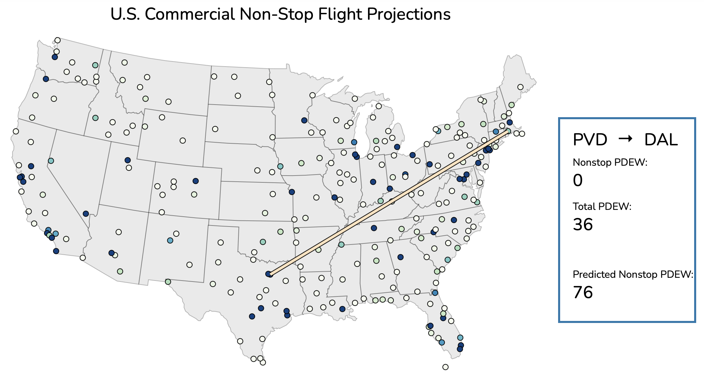

# Nonstop Flight Model
## Joshua Neronha, April 2021

Check out the model [here](https://joshuaneronha.github.io/nonstop-flight-model/) with an example image of the visualization below. Also feel free to check out the [Jupyter notebook](https://github.com/joshuaneronha/nonstop-flight-model/blob/main/Model.ipynb) for more details on how the model itself was built and a [blog post](https://joshuaneronha.com/blog_posts/air_model.html) I wrote about the project.

